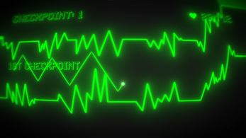
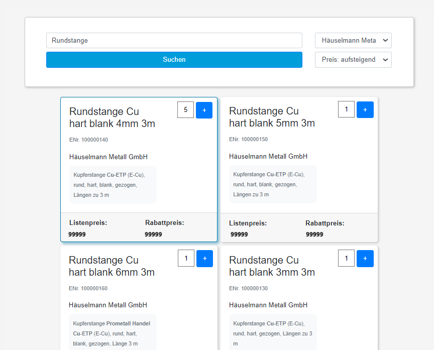
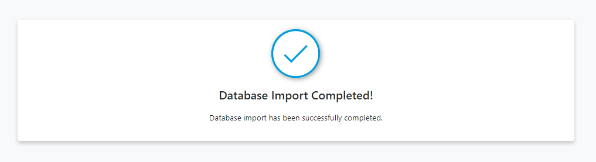

# 👋 Hi, I’m Dima

I'm a passionate **Software Engineer** with more than **4 years** of hands-on experience, both as a solo developer and as the *first* Software Developer at Lehmann Elektro. 

Throughout this time, I have delved into diverse projects spanning a wide array of languages and technologies, equipping me with a profound grasp of low-level programming principles, design patterns, and the art of getting things done in the most efficient and robust ways. My skillset and passion lean more into **backend development**, as I love to work on projects that require a solid understanding of software architecture, fast problem-solving, and logical thinking.

## 🔧 Skills

```text
C#            | Linux       | Go            | Rust          | Tauri        | Bash 
Docker        | Python      | TypeScript    | PostgreSQL    | MongoDB      | Ruby 
Ruby on Rails | JavaScript  | HTML/CSS      | C++           
```

I excel in **.NET**, **Linux** and **Node.js** development.  
I had used **Linux** as my main OS for more over a year, which had not only become integral to my workflow but had also given me the foundational knowldge of Bash scripting and other Linux components

<details>
    <summary><b>:floppy_disk: GitHub Stats</b></summary>
<div align="center">
    
    
    <a href="https://git.io/streak-stats"></a>
</div>

 </details>

[//]: # (portfolio section)
<details>
    <summary><b>📂Portfolio</b></summary>

<details>
    <summary><b>-📂Game Development</b></summary>
        <details>
    <summary><b>--📦Lehmann Stylized Pac-Man Clone</b></summary>
    <h3>Lehmann Stylized Pac-Man Clone</h3>
    <p>A custom clone of the classic arcade game "Pac-Man," designed and stylized to align with lehmann's brand identity. Developed in C# using Unity, this project included a leaderboard feature, custom levels, and ghost designs that represented sponsors and the company’s branding, making it a unique marketing tool.</p>
    <p><b>Role:</b> Unity Game Developer</p>
    <p><b>Company:</b> A-Lehmann-Elektro-AG</p>
    
    
    
    
</details>
<details>
    <summary><b>--📦DVDE</b></summary>
    <h3>DVDE: Dude Story (Read as "Dude")</h3>
    <p>DVDE is an archived 2D Top-Down shooter, I started developing back in the fall 2021, but never got to release it.</p>
    <p>About: `DVDE: Dude Story is a Top-down Shoot'em-up 2d shooter with the bunch of guns, upgrades, skills, customization and AI enemies. Your main task is to pass through procedurally generated rooms and destroy enemies.</p>
    <p><b>Role:</b> Unity Game Developer</p>
    <p><b>Company:</b> Self-Employed</p>
    <h4>GitHub: <a href="https://github.com/d1msk1y/DVDE">d1msk1y/dvde</a></h4>
    <h4>Game Trailer: <a href="https://www.youtube.com/watch?v=PBXpun9bqEw">Youtube | DVDE Trailer</a></h4>
</details>
<details>
<summary><b>--📦Insane Islands</b></summary>
<h3>Insane Islands</h3>
<p>Insane Islands is a 3D adventure game I developed quite a while ago, back in 2021</p>
<p>About:
You play as a bomb💣, your main task is to get to the finish line before it explodes, only the difficulty lies in the fact that the bomb is controlled by tilting your phone, the faster you pass the level, the more stars you get🌟.

You have to ride on wooden bridges in the forest with extreme jumps.
In some levels, you have to be cunning to pass the level faster and get more stars🌟</p>
<p><b>Role:</b> Unity Game Developer</p>
<p><b>Company:</b> Self-Employed</p>
<h4>GitHub: <a href="https://github.com/d1msk1y/insane-islands">d1msk1y/insane-islands</a></h4>


</details>
<details>
<summary><b>--📦Pulsfire: Signs of Life</b></summary>
<h3>Pulsfire: Signs of Life</h3>
<p>This is a submission to a 48 hours game jame "Area of Effect 2021" with the theme "Signs of Life"

About: Puls Fire: SoF is a runner game created in 2 days for Area of Effects 2021 Game Jam. The main character is in intensive care. Doctors have given him a chance to survive with the help of a defibrillator, but he must keep his heart rate within a normal range to stay alive.</p>
<p><b>Role:</b> Unity Game Developer</p>
<p><b>Company:</b> Self-Employed</p>
<h4>GitHub: <a href="https://github.com/d1msk1y/signs-of-life">d1msk1y/signs-of-life</a></h4>
<h4>Itch IO: <a href="https://aaj-studio.itch.io/pulsfire">Dedicated Webpage</a></h4>



</details>
<details>
    <summary><b>--📦Danger Cube</b></summary>
    <h3>Danger Cube</h3>
    <p>This is the first project I had released back in 2021, and that im least proud of, however I think it is still worth mentioning, for the sake of the complete portfolio</p>
    <p>About: Danger Cube is basically a really simple 2d runner built on unity. You play as a cube, cube hit another cube = death, as simple as that. You can unlock various skins by reaching more score. It is pointless to mention how bad the code is, if you're brave enough to take a look at it, you're welcome to the github repo below</p>
    <p><b>Role:</b> Unity Game Developer</p>
    <p><b>Company:</b> Self-Employed</p>
    <h4>GitHub: <a href="https://github.com/d1msk1y/danger-cube">d1msk1y/dange-cube</a></h4>
    
    
</details>

</details>
    <details>
        <summary><b>-📦Lehmann Connector (v2.0)</b></summary>
        <h3>Lehmann Connector (v2.0)</h3>
        <p>A .NET application designed to streamline the management of incoming calls for On-Call Support by displaying the caller's customer information. Originally integrated with 3CX, a business phone system, I contributed to the project by developing the integration with Microsoft Teams, alongside other miscellaneous features. Additionally, I played a key role in revamping the licensing system by developing a Cloud Licensing Service hosted on Azure Functions.</p>
        <p><b>Role:</b> Backend .NET Developer</p>
        <p><b>Company:</b> A-Lehmann-Elektro-AG</p>
        
    </details>
    <details>
        <summary><b>-📦Webshop</b></summary>
        <h3>Webshop</h3>
        <p>Webshop is an integrated into a Business-Software product catalogue that lists products imported into the Mongo DB from an XML/CSV file. The Webshop interacts with the Business-Software's API to add desired items to an invoice/project/ticket with all the required params like: Buy/Sell Price, Manufacturer, Quantity and Description. The backend is on Node.JS with handlebars for lighweight server-side rendering. The Webshop's REST API provides endpoints for manual import; UI import with progress bar and import status; and the actual catalogue page.</p>
        <p><b>Role:</b> Full-Stack node.js Developer</p>
        <p><b>Company:</b> A-Lehmann-Elektro-AG</p>
        
        
    </details>
    <details>
        <summary><b>-📦Grafana Solar Flow</b></summary>
        <h3>Grafana Solar Flow</h3>
        <p>A custom Grafana plugin for visualizing real-time solar panel data, displaying the current production, usage, and waste ratios. The plugin is built using TypeScript and leverages the Grafana SDK to interact with the Grafana backend, providing an intuitive and informative dashboard for solar energy management.</p>
        <p><b>Role:</b> Database Plugin Developer</p>
        <p><b>Company:</b> A-Lehmann-Elektro-AG</p>
        <h4>GitHub: <a href="https://github.com/A-Lehmann-Elektro-AG/solar-flow-grafana">A-Lehmann-Elektro-AG/solar-flow-grafana</a></h4>
        
    </details>
    <details>
        <summary><b>-📦Aepli Solar</b></summary>
        <h3>Aepli Solar</h3>
        <p>A web application for solar energy visualization, allowing users to monitor real-time data from solar panels. My contributions to this project laid the groundwork for the development of a related Grafana plugin, enhancing data visualization capabilities.</p>
        <p><b>Role:</b> Full-Stack node.js Developer</p>
        <p><b>Company:</b> A-Lehmann-Elektro-AG</p>
        
    </details>
        <details>
        <summary><b>-📦Fusion Solar</b></summary>
        <h3>Fusion Solar</h3>
        <p>A solar energy visualization web application that I contributed to, featuring customizable color palettes and iconography. This tool allows users to monitor and visualize solar energy production and usage with a tailored interface that fits various branding requirements.</p>
        <p><b>Role:</b> Full-Stack node.js Developer</p>
        <p><b>Company:</b> A-Lehmann-Elektro-AG</p>
        
    </details>
</details>
</details>
